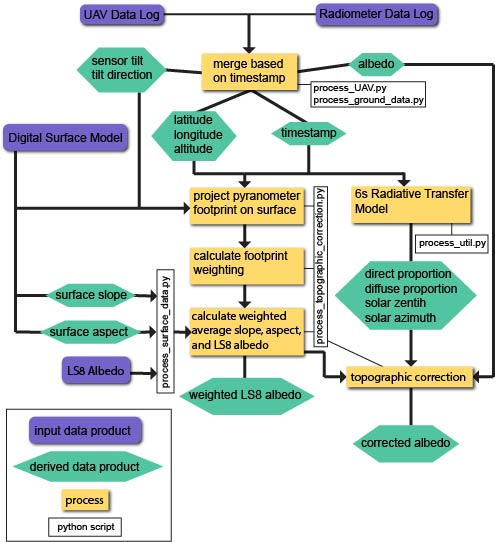

# UAV-Albedo

UAV-Albedo is a Python library for processing albedo data collected from an upward and downward-facing pyranometer. The project also contains code to compare pyranometer measurements with a rasterized albedo product, which in this case is Landsat 8-derived albedo.

## Requirements
* Datalog containing the following fields from the UAV
	* date and time
	* pitch
	* roll
	* yaw
	* latitude
	* longitude
	* altitude (above mean sea level)
* Datalog containing the following fields from the pyranometers
	* date and time
	* Incoming irradiance (W/m^2)
	* reflected irradiance (W/m^2)
* Terrain models 
	* elevation
	* slope
	* aspect
	* note: all terrain models must have the same geographical extent and pixel size
* External gridded albedo product
	* note: must have the same geographical extent and pixel size as terrain models

# Program Structure
There are 6 python programs that make up the core of the data processing

## Class process_UAV
This class contains the code required to process UAV albedo data and convert it into a .csv file that contains all required fields for the topographic correction and comparison to external gridded albedo data.

## Class process_ground_data
This class is similar to process_UAV in that it preprocesses the albedo/carrying platform data for ingestion into the topographic correction and comparison processes. This class is tailored to the research outlined in Mullen et al., 2021 to merge and preprocess ground validation data.

## Class process_surface_data
This class is used in the creation of a Surface_Data object containing all required surface raster data (elevation, slope, aspect, gridded albedo product for comparison (in this case LS8)) for topographic correction and comparison to the external product.

## Class process_topographic_correction
This class is used in the creation of a topographic correction object. The topographic correction object contains calculated surface parameters, uncorrected albedo, corrected albedo, and the albedo value derived from the external product used for comparison. Creation of an instance of this object requires a surface data object and a series (single line from dataframe) or dictionary corresponding to a single albedo measurement.

## process_main
This python script handles all processing of the UAV data from a higher level. All data paths and user-defined parameters are set in this file. This file allows for UAV data pre-processing, topographic correction, as well as footprint sensitivity analyses.

## process_util
This python script contains methods used in multiple other scripts within the project.

## Workflow



## Usage
Downloading required dependencies is done easily through Anaconda

To install the environment, in an Anaconda prompt enter:

```bash
conda env create --file path_to_uav-albedo_directory/uav-albedo.yml
```

to activate the environment

```bash
conda activate uav-albedo
```

now, edit the following code lines in 'process_main.py' with the proper paths and filenames

```python

PATH_TO_DJI_CSV = 'path_to_raw_dji_flight_log.csv'
PATH_TO_METEON_CSV = 'path_to_raw_radiometer_datalog.csv'
PATH_TO_OUTPUT_LOG = 'path_to_output_preprocessed_uav_albedo_log.csv'
PATH_TO_PREPPED_LOG = 'path_to_preprocessed_uav_albedo_log.csv'

PATH_TO_IMU_CSV = 'path_to_raw_imu_log.csv'
PATH_TO_GROUND_METEON = 'path_to_raw_radiometer_datalog.xls'
PATH_TO_GPS_DATA = 'path_to_ground_validation_gps_log.csv'
PATH_TO_OUTPUT_IMU = 'path_to_output_preprocessed_validation_measurements.xlsx'

LOCAL_UTM_EPSG = 'EPSG:32612' #UTM Zone 12N for Montana
PYRANOMETER_BANDWIDTH = [0.31, 2.7] #in micrometers, 0.31-2.7 for Kipp and Zonen PR1 pyranometers

SfM=Surface_Data('name_of_surface_model.tif', 
                'name_of_slope_raster.tif', 
                'name_of_aspect_raster.tif', 
                'name_of_ls8_albedo_raster.tif',
                'name_of_x_coordinate_array_raster.tif', 
                'name_of_y_coordinate_array_raster.tif')
				
```

## Contributing
Pull requests are welcome. For major changes, please open an issue first to discuss what you would like to change.

Please make sure to update tests as appropriate.


## License
[MIT](https://choosealicense.com/licenses/mit/)